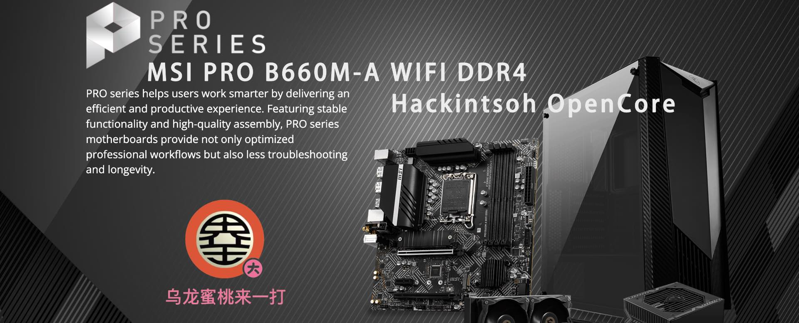

## MSI PRO B660M-A WIFI DDR4 Hackintosh OpenCore EFI



### [简体中文](README.zh_CN.md)


### OpenCore

[OpenCore 1.0.0](https://github.com/acidanthera/OpenCorePkg)


### macOS

- Sonoma
- Ventura
- Monterey


### Spec

- Chipset: B660
- BIOS: 7D43v1E 2023-09-13
- CPU: Intel 12th i5-12500
- Memo: KingBank A-Die 32GB(16GB*2) DDR5 6000 Mhz
- SSD: KingBank  KP330 128G Windows
- SSD: UNIC P5160-512G MacOS
- HDD: Seagate ST1000 1TB
- GPU: MSI AMD Radeon RX 6650 XT 8GB GDDR6
- HDA: Realtek ALC897
- LAN: Realtek RTL8125 Gaming  2.5GbE
- WLAN: BCM943602CS
- CPU COOLING: Thermalright AX120R
- CASE:  SAMA EASY MASTER Deluxe Edition ATX (BLACK)
- PSU:  FOCUS GX-750 GOLD 750W


### BIOS

```
Settings
  |-- Security
     |-- Secure Boot
       |-- Secure Boot: Disabled
       
Search
  |-- D.T.M
    |-- D.T.M: Enabled
```


### Notes

 - Use [OCAuxiliaryTools](https://github.com/ic005k/OCAuxiliaryTools) build your SMBIOS


### Tools

- [Hackintool](https://github.com/headkaze/Hackintool) 
- [OCAuxiliaryTools](https://github.com/ic005k/OCAuxiliaryTools) AKA `OCAT`.
- [OpenCore Configurator](https://mackie100projects.altervista.org/opencore-configurator/) AKA `OCC`.
- [gibMacOS](https://github.com/corpnewt/gibMacOS) Build your own MacOS image.
- [ProperTree](https://github.com/corpnewt/ProperTree) Plist editor.


### Contact Us

QQ Group: 23304408


